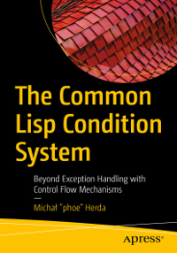

# Apress Source Code

This repository accompanies [*The Common Lisp Condition System*](https://www.apress.com/9781484261330) by Michał "phoe" Herda (Apress, 2020).

[comment]: #cover

The sources are split into sources for the first part of the book and the appendices (the [`Sources - TCLCS`](Sources%20%20TCLCS/) folder) and sources for Portable Condition System (PCS, the [`Sources - PCS`](Sources%20-%20PCS/) folder). Note that the sources for PCS are for version 1.1.0 of the library; for pushing updates upstream, please see [the main repository of the project](https://github.com/phoe/portable-condition-system).

Download the files as a zip using the green button, or clone the repository to your machine using Git.

## Releases

Release v1.0 corresponds to the code in the published book, without corrections or updates.

## License

The source code for TCLCS is licensed under the CC0 license and placed in the public domain.

The source code for Portable Condition System is licensed under the CC0 license and placed in the public domain, except for the test suite, which is licensed under the MIT license. Please see the `README` and `LICENSE` files in the respective subfolders of this repository for details.

## Contributions

See the file Contributing.md for more information on how you can contribute to this repository.
